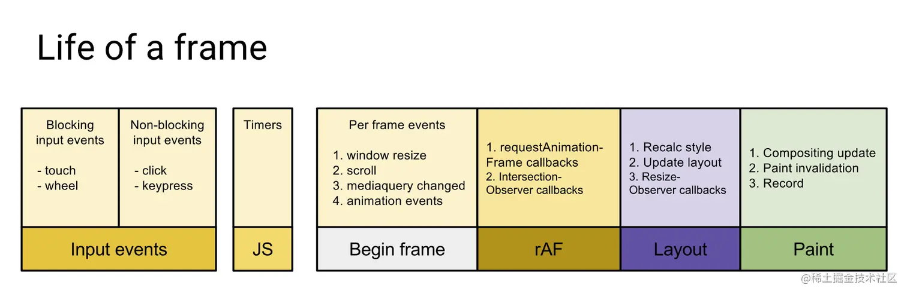

# WEB SCHEDULER

WEB SCHEDULER 是一个应用于浏览器环境的任务调度工具。用于管理系统运行过程中的各类任务，支持大量、高频、高耗时任务的场景，帮助提高系统性能，提升系统流畅度。

## 安装

你可以使用 npm、pnpm或者yarn 进行安装：

```bash
    npm install web-sheduler

    yarn add web-sheduler

    pnpm add web-sheduler
```

## 使用

支持多种任务调度模式，对应浏览器运行的各个阶段，支持自定应任务调度。



### TaskList

基于哈希表和双向跳表的任务列表，

`TaskList` 是一个 JavaScript 类，用于管理任务列表，用于定制化任务调度场景。它基于哈希表和双向跳表实现，允许你添加、删除和更新任务，并根据优先级和超时时间对任务进行排序。后续所有任务调度器都基于此任务列表开发。

`定制化任务调度场景才会用到，正常使用只需了解运行逻辑即可。`

#### TaskList示例

```ts
import { TaskList, PRIORITY_TYPE } from 'web-scheduler';

// 创建任务列表
const taskList = new TaskList();

// 添加任务
taskList.put(() => conosle.log("任务1"));

taskList.put(() => conosle.log("任务2"), { 
    key: '任务2', 
    priority: PRIORITY_TYPE.NORMAL, 
    callback:() => console.log("任务2 回调函数") 
});

// 取出首个任务并执行
const task = taskList.shift()
task?.run()

// 更新任务
taskList.put(() => conosle.log("更新任务2"), {
    key: '任务2',
    priority: PRIORITY_TYPE.LOW, 
    callback:() => console.log("更新任务2 回调函数") 
});

// 判断任务队列是否为空
taskList.isEmpty();

// 检查任务是否存在
taskList.has('任务1'); // 输出：true/false

// 获取首个任务的超时时间
taskList.getFirstTimeOut()

// 重新设置不同优先级对应的超时时间
// 默认各优先级超时时间
export const DEFAULT_PRIORITY_TIMEOUT = {
    [PRIORITY_TYPE.IMMEDIATE]: -1 as const,
    [PRIORITY_TYPE.HIGH]: 250,
    [PRIORITY_TYPE.NORMAL]: 1000,
    [PRIORITY_TYPE.LOW]: 5000,
    [PRIORITY_TYPE.IDLE]: 1073741823 as const
}

taskList.setPriorityTimeout({
    [PRIORITY_TYPE.HIGH]: 2500,
    [PRIORITY_TYPE.NORMAL]: 10000,
    [PRIORITY_TYPE.LOW]: 50000,
})

```

#### TaskList注意事项

- 默认使用symbol当作key值，不需要更新任务的场景不需要设置options.key参数

- 任务队列基于超时时间进行排序，优先级只影响任务的超时时间的设置

- 默认支持的任务调度器中，会优先执行距离超时最近的任务，已超时任务会无视刷新率快速处理掉，自定义任务调度需要自行编写处理策略

- 使用key值更新任务后，val会被替换掉所以并不保证一定会执行

- 使用key值更新任务后，会合并新旧的callback回调，所以必须要确保执行的代码请使用callbak

- 使用key值更新任务后，如果新的超时时间更紧急会向前移动任务，反之则继续使用旧任务的超时时间

- 修改优先级对应的超时时间不影响先前插入的任务

### AnimationFrameScheduler

`AnimationFrameScheduler` 是一个基于 `requestAnimationFrame` 的任务调度器，适用于需要进行 DOM 操作的场景。

- 执行阶段：rAF
- 时间分片时长：默认通过估算屏幕刷新率计算。例如fps为60hz，Math.floor(1000/{fps}/2) = 4ms
- 已超时任务无视时间分片时长强制运行

#### AnimationFrameScheduler示例

```ts
import { animationFrameScheduler } from 'animation-frame-scheduler';

// 设置优先级、时间分片时长
await animationFrameSchedular.setConfig ({ 
    priorityTimeoutParams: {
        [PRIORITY_TYPE.HIGH]: 2500,
        [PRIORITY_TYPE.NORMAL]: 10000,
        [PRIORITY_TYPE.LOW]: 50000,
    }, 
    frameDuration: 5
}

// 添加任务到调度器
animationFrameScheduler.pushTask(() => {
  // 这里是任务的具体逻辑
});

animationFrameScheduler.pushTask(() => conosle.log("任务2"), { 
    key: '任务2', 
    priority: PRIORITY_TYPE.NORMAL, 
    callback:() => console.log("任务2 回调函数") 
});
```

### SingleAnimationFrameScheduler

`SingleAnimationFrameScheduler` 是一个基于 `requestAnimationFrame` 的任务调度器，它每帧只执行一个任务，通常用于逐帧操作动画或其他需要按帧处理的任务。这个调度器可以确保在每一帧中只执行一个任务，方便自定义动画的开发，并且避免卡顿和提供流畅的用户体验。

- 执行阶段：rAF
- 每一帧只执行一次，没有时间分片时长概念
- 即使任务已经超时，也会按照排序逐帧执行

#### SingleAnimationFrameScheduler示例

```ts
import {
    singleAnimationFrameScheduler,
} from 'web-scheduler'

const circle = document.querySelector('.circle') as HTMLElement;


circle.onclick = ()=>{
    for(let i=0; i< 1000; i++){
        singleAnimationFrameScheduler.pushTask(()=>{
            circle.style.width = `${i}px`
            circle.style.height = `${i}px`
        })
    }
}
```

### ImmediateScheduler

`ImmediateScheduler` 是一个基于 `setImmediate` 的任务调度器，用于执行非 DOM 操作的重要任务。它适合用于处理需要尽快执行的任务，如数据处理、网络请求等，但不推荐用于操作 DOM。

- 执行阶段：JS
- 时间分片时长：默认通过估算屏幕刷新率计算。例如fps为60hz，Math.floor(1000/{fps}/2) = 4ms
- 已超时任务无视时间分片时长强制运行

#### ImmediateScheduler示例

```ts
import { immediateScheduler } from 'web-scheduler';

function fetchData() {
  // 模拟异步数据请求
}

function processData() {
  // 处理数据
  console.log('Data processed.');
}

// 启动任务
immediateScheduler.pushTask(fetchData);
immediateScheduler.pushTask(processData);

```

### IdleFrameScheduler

`IdleFrameScheduler` 是一个基于 `requestIdleCallback` 的任务调度器，它允许你在浏览器的每一帧的空闲时间执行任务。这样可以最大程度地利用计算资源，特别适用于执行非关键任务。

- 执行阶段：Paint之后执行
- 时间分片时长：浏览器渲染一帧全部工作完成后的剩余时长 （1000/{fps} - 已用时长）
- 已超时任务无视时间分片时长强制运行
- 主要用于执行非关键任务，以充分利用浏览器的空闲时间。不建议将关键任务放在此调度器中，如果一直没有空闲时间，任务会超时后才能执行。

#### IdleFrameScheduler示例

```ts
import { idleFrameScheduler } from 'web-scheduler';

function log() {
    // 打印日志
}
function report() {
    // 上报数据
}

// 启动任务
idleFrameScheduler.pushTask(log);
idleFrameScheduler.pushTask(report);
```
